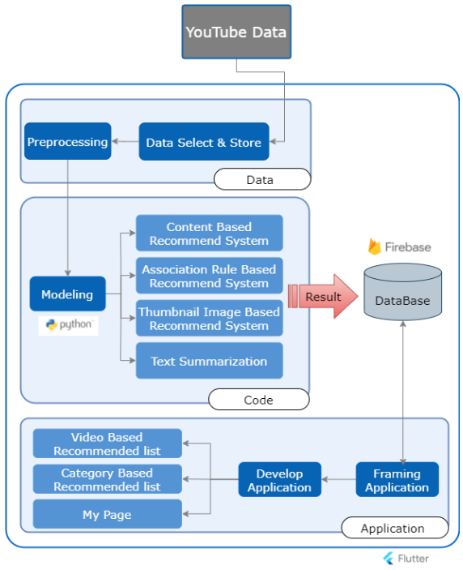

# 
 YouTube lecture video recommendation system   for computer science learning

    

### Contents
1. [Overview](#overview)
2. [Requirements](#requirements)
3. [Languages and Development Tools](#languages-and-development-tools)
4. [Issue](#issue)
5. [Usage](#usage)
6. [Architecture](#architecture)
7. [Repository Explaination](#repository-explaination)
8. [Result](#result)
9. [Conclusion](#conclusion)
10. [Reference](#reference)
11. [Developer](#developer)

### Overview
  Our goal is providing a specialized Youtube environment for CS learning by limiting the Youtube videos entered in the Youtube database to CS-related videos for users who watch Youtube contents for the purpose of learning in the CS field.
By grouping and displaying CS-related videos by category, we made it possible to watch videos suitable for learning purposes, and build a various recommendation systems so that viewers can watch a wide field of videos.  

First, we built a database storing 2,189 YouTube video instances related to a total of 20 learning topics in the field of computer science using the Youtube API. Second, we implemented code for accessing data stored in Firebase database and interworking with flutter. Then, we implemented content-based collaborative system, association rule mining system, and image clustering with Python modeling to recommend videos to users using collected YouTube data. Also, we made UI and UX in flutter to make it easy for users to intuitively recognize the list of recommended videos by recommendation type and category, and viewing records. This project was carried out as an assignment at Kyung Hee University.  
  
 최종 목표는 CS분야에서 학습을 목적으로 Youtube 콘텐츠를 시청하는 사용자를 위해 Youtube의 Database에 들어간 Youtube영상을 CS 관련 영상으로 한정하여 CS학습을 위해 특화된 Youtube 환경하는 것이다. 카테고리별 영상 묶음으로써 학습 목적에 맞는 영상 시청이 가능하도록 하였으며, 다양한 형태의 영상추천시스템 구축함으로서 폭넓은 영상 시청할 수 있도록 하고자 하였다.   
 
  첫번재로, Youtube API를 통해 수집한 computer science 분야의 학습 주제 총 20개에 관련한 2,189개의 youTube동영상 instance들을 저장하는 데이터베이스를 구축하였고, 두 번재로 Firebase의 database에 저장된 데이터에 대한 접근과 flutter의 연동을 위한 코드 구현하였다. 다름으로 수집된 YouTube 데이터를 활용해 사용자에게 영상을 추천하기 위한 content based collaborative system, Association rule mining system, image clustering을 파이썬으로 구현하였으며, 마지막으로 사용자에게 추천 유형별, 카테고리별 추천 영상들의 목록, 시청 기록 등을 직관적으로 알아보기 쉽도록 flutter에서 UI , UX구현하였다. 본 프로젝트는 경희대학교 과제로 수행되었다.

### Requirements
+ Python 3.6
+ Android Studio 4.2.1

### Languages and Development Tools
   
     

### Issue
+ make_video.py is being modifyed.

### Usage
Filetree (modifying)

### Architecture
[📑 Here is Detailed Project Description]()

   

### Repository Explaination
###### 📠sdsapp Developed application folder. mainapp.dart is a main dart file. 
###### 📠data_aquisition Data collecting code using YouTube Data API
> ###### 📠csv Total data collected by category. Data such as search, title, number of views, and number of likes.
> ###### 📠videos Metadata for each video (.json)
> ###### 📠subtitles Subtitle data of lecture video obtained using youtube-transcript-api
> ###### 📠data Summarized subtitle data (.json, .csv)
> ###### 📄 make_recommendation.py The code that stores a list of recommendations by category
> ###### 📄 make_video.py The code that stores metadata and recommendation list for each video
> ###### 📄 summarize.py<br/The code that summarizes and saves the saved subtitle data
> ###### 📄 SDS_content_based_recommendation.ipynb The code that saves a recommendation list using content based recommendation per videoID based on title
> ###### 📄 maketsne.py The code that reduces the dimension of an image thumbnail to tsne and saves it

###### 📠firestore Data for uploading data to the Firebase Firestore database and node.js project files 
> ###### 📄 video.json Metadata of each video and recommended list information for each video
> ###### 📄 user.json The video ID information of the video watched and liked by the virtual user using the app.
> ###### 📄 recommendation.json The number of views, number of likes, and recently uploaded video recommendation list for each category.
> ###### 📄 index.js The code to upload the above files to the Firestore database. In the firebase.initializeApp() function, you must enter the value of the API key assigned to each of you.

### Result
[📽 Here is Application Demo Video](https://drive.google.com/file/d/1SLPcyupCKiRhhxkCYXfACbGaBZ4pzmKs/view?usp=share_link)
#### Video Based Recommended list

#### User Based Recommended list

#### My Page

### Conclusion
In the recommendation system, we implemented a total of three recommendation systems: content-based, association rule-based, and thumbnail image-based. Unlike existing YouTube, the recommendation system has been diversified, and users can check the system.  
Also, This application was developed by interconnecting three: python-firebase-flutter. It's rarecase in which all these three are linked, and since all are free distribution, it is meaningful in that reduced development costs.  
By implementing text summarization, it not only provides users with a simple YouTube video viewing platform, but also provides video summary information. It is meaningful in that it provides additional information for selection, not just video recommendation, to a user who selects a video to watch for learning purposes.  
The application created through this project is expected to increase added value and build a new learning platform by contributing close to the essence of shared content. In addition, based on the above, it is expected to create a new market for low-cost app development that links three tools using free distribution tools and sources. Lastly, if the scope is expanded to parascience and medical science, it is expected that students from socially disadvantaged classes will be able to study by finding high-quality lecture contents.

### Reference
+ Bae, J.-H., & Shin, H.-Y. (2020). 대학교육의 질 제고를 위한 이러닝 활성화 방안 연구: 유튜브 러닝 콘텐츠 사례를 중심으로. 한국융합학회논문지, 11(7), 309–317. https://doi.org/10.15207/JKCS.2020.11.7.309
+ BAher, S., & L.M.R.J., L. (2012). Best Combination of Machine Learning Algorithms for 3Course Recommendation System in E-learning. International Journal of Computer Applications, 41(6), 1–10. https://doi.org/10.5120/5542-7598
+ Chtouki, Y., Harroud, H., Khalidi, M., & Bennani, S. (2012). The impact of YouTube videos on the student’s learning. 2012 International Conference on Information Technology Based Higher Education and Training (ITHET), 1–4. https://doi.org/10.1109/ITHET.2012.6246045
+ Covington, P., Adams, J., & Sargin, E. (2016). Deep Neural Networks for YouTube Recommendations. Proceedings of the 10th ACM Conference on Recommender Systems, 191–198. https://doi.org/10.1145/2959100.2959190
+ DeWitt, D., Alias, N., Siraj, S., Yaakub, M. Y., Ayob, J., & Ishak, R. (2013). The Potential of Youtube for Teaching and Learning in the Performing Arts. Procedia - Social and Behavioral Sciences, 103, 1118–1126. https://doi.org/10.1016/j.sbspro.2013.10.439
+ Hidalgo, E. A., Tehas, F. S., & Magana, S. de M. (n.d.). MushroomApp: A Mushroom Mobile App. 18.
+ Jaffar, A. A. (2012). YouTube: An emerging tool in anatomy education. Anatomical Sciences Education, 5(3), 158–164. https://doi.org/10.1002/ase.1268
+ Moon, E.-M. (2019). An Analysis on YouTube Contents to Build E-learning Videos for Interior Design Education. Journal of the Korean Institute of Interior Design, 28(6), 41–50. https://doi.org/10.14774/JKIID.2019.28.6.041
+ Nasar, Z., Jaffry, S. W., & Malik, M. K. (2019). Textual keyword extraction and summarization: State-of-the-art. Information Processing & Management, 56(6), 102088. https://doi.org/10.1016/j.ipm.2019.102088
+ Yoo, T., Jeong, H., Lee, D., & Jung, H. (2021, April). LectYS: A System for Summarizing Lecture Videos on YouTube. In 26th International Conference on Intelligent User Interfaces (pp. 90-92).
+ Van der Maaten, L., & Hinton, G. (2008). Visualizing data using t-SNE. Journal of machine learning research, 9(11).
+ https://ko.wikipedia.org/wiki/%EC%BD%94%EC%82%AC%EC%9D%B8_%EC%9C%A0%EC%82%AC%EB%8F%84
+ https://en.wikipedia.org/wiki/Apriori_algorithm

### Developer
Hyunji Kim, Taewon Yoo, Hyunjin Jeon.
 
Hyunji Kim's <a href="mailto:hjk021@khu.ac.kr">  
	
